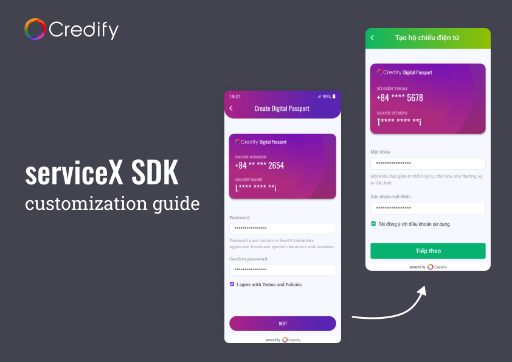
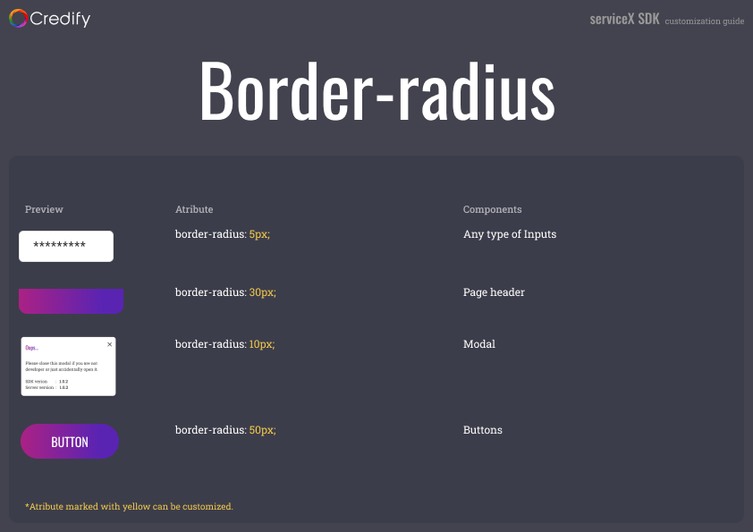
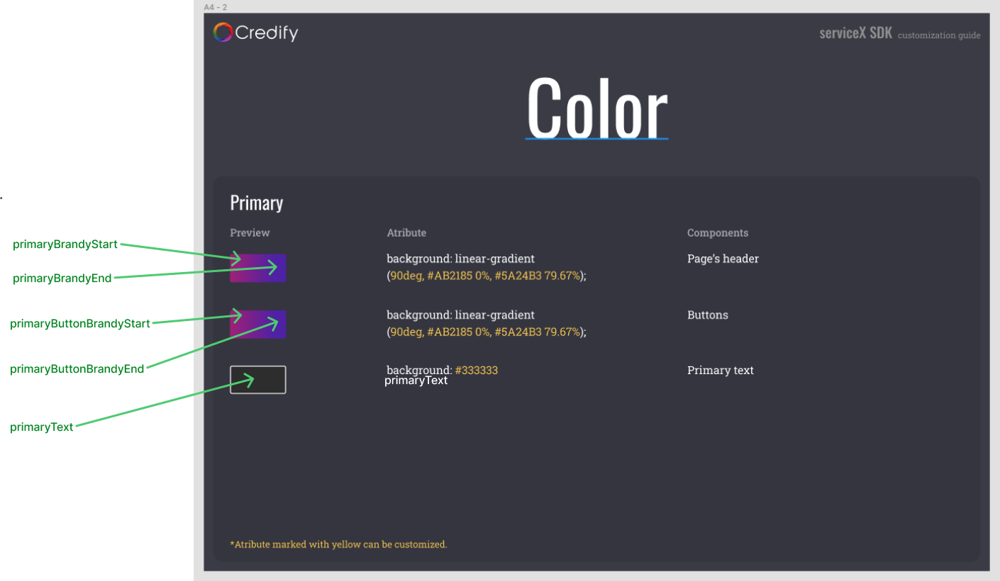
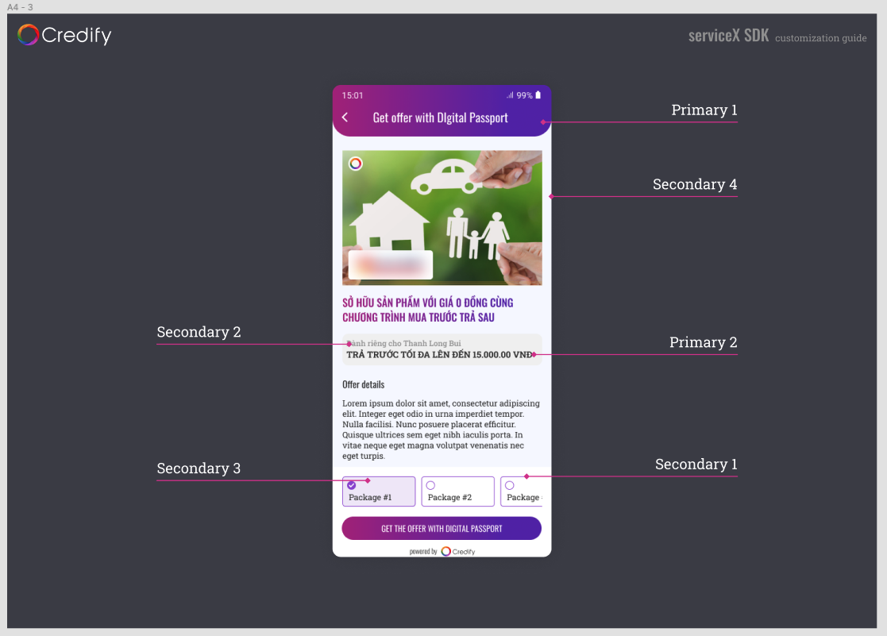
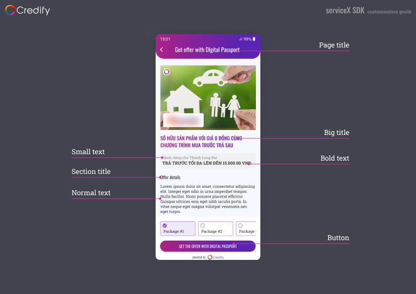
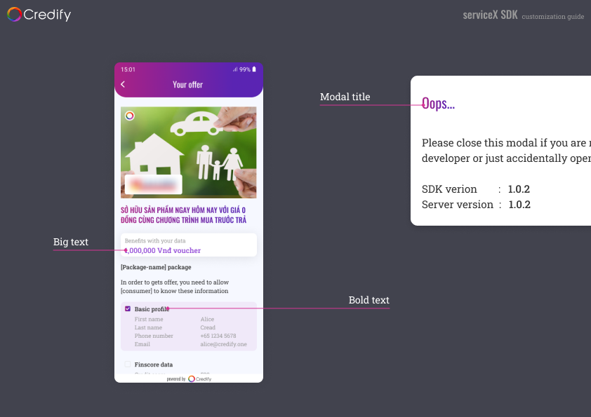
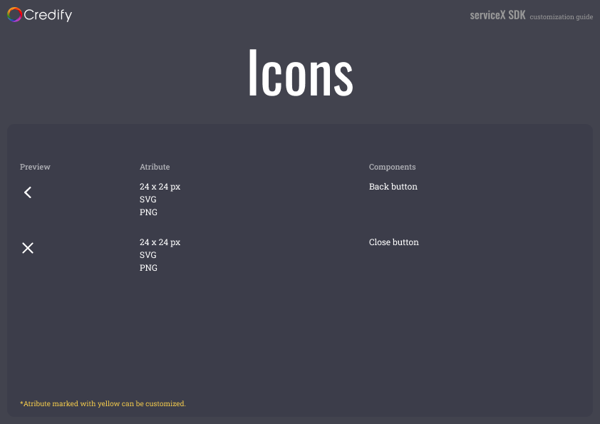

# Credify SDK Sample

The SDK supports API level 23 and above ([distribution stats](https://developer.android.com/about/dashboards)).

Update the `build.gradle`(project level).

```java
allprojects {
    repositories {
        ...
        maven { url 'https://jitpack.io' } // Add this line if you are using SDK version `v0.1.x`.
        mavenCentral()
    }
}
```

Update the `build.gradle`(app level).

```java
dependencies {
    implementation 'one.credify.sdk:android-sdk:v0.2.0'
}
```

**Note**: Update the `build.gradle`(app level) for SDK version `v0.1.x`.

```java
android {
    ...

    aaptOptions {
        noCompress "tflite"
        noCompress "lite"
        noCompress "bic"
    }
    ...
}
```

Sync project with Gradle file.

**Note:** If you gets the below error when you build your project.


Then you need to add this line *tools:replace="android:supportsRtl"* into the *<application>* element in the *AndroidManifest.xml*.


## Getting stated

### Set up the SDK

Create `CredifySDK` instance.

If you have created a class that extends from `Application` class. You only add the below code to the `onCreate()` method.
You can generate a new API key on the serviceX dashboard.

```kotlin
override fun onCreate() {
    super.onCreate()
    ...
    CredifySDK.Builder()
        .withApiKey([Your API Key])
        .withContext(this)
        .withEnvironment([Environment])
        .withTheme([ServiceXThemeConfig]) // it's available on SDK version v0.1.11
        .build()
    ...
}
```

Otherwise, you will need to create a new class that extends from `Application` class. In this example, I named it with `DemoApplication`.

```kotlin
...
class DemoApplication : Application() {
    override fun onCreate() {
        super.onCreate()

        // Generates a singleton here
        CredifySDK.Builder()
            .withApiKey([Your API Key])
            .withContext(this)
            .withEnvironment([Environment])
            .withTheme([ServiceXThemeConfig]) // it's available on SDK version v0.1.11
            .build()
    }
    ...
}
```

**AND** update your `AndroidManifest.xml` file.

```xml
<application
    android:name=".DemoApplication"
    ...
    >
    ...
</application>
```

After creating the `CredifySDK` instance, you can access the singleton like following:

```kotlin
val credifySDK = CredifySDK.instance
```

### Offer usage

#### Get offers list

First, you need to create a parameter object by using `GetOfferListParam` class.

Secondly, to get offers list from the Credify SDK, you should use `getOfferList` method:

```kotlin
val params = GetOfferListParam(
    phoneNumber = // Your user phone number (Optional) - e.g. "32123456789",
    countryCode = // Your user phone number country code (Optional) - e.g. "+84",
    localId = // Your user id,
    credifyId = // Your user's credify id (Optional)
)

CredifySDK.instance.offerApi.getOfferList(params = params, callback: OfferListCallback)
// OR
CredifySDK.instance.offerApi.getOfferList(params = params): Observable<OfferList>

// NOTE: you need to pass credifyId when you call `CredifySDK.instance.offerApi.showOffer` method
data class OfferList(val offerList: List<Offer>, val credifyId: String?) : Serializable
```
    
> **Important**: you need to keep `credifyId` on your side. You have to send the `credifyId` to Credify SDK when you use the methods that require `credifyId`. E.g: `CredifySDK.instance.offerApi.showOffer`

#### Show an offer detail

Create `one.credify.sdk.core.model.UserProfile` object.

```kotlin
val user = UserProfile(
    id = // Your user id,
    name = UserName(
        firstName = // Your user's first name,
        lastName = // Your user's last name,
        middleName = // Your user's middle name (Optional),
        name = // Your user's full name (Optional)
    ),
    phone = UserPhoneNumber(
        phoneNumber = // Your user's phone number,
        countryCode = // Your user's phone country code
    ),
    email = // Your user's email,
    dob = // Your user's day of birth (Optional),
    address = // Your user's address (Optional),
    credifyId = // Your user's credify id. If your user have created Credify account then it should not be null
)
```

To show an **offer detail** by using:

```kotlin
CredifySDK.instance.offerApi.showOffer(
    context = // Context,
    offer = // one.credify.sdk.core.model.Offer object,
    userProfile = // one.credify.sdk.core.model.UserProfile object,
    credifyId = // Your user's credify id. If your user have created Credify account then it should not be null. It's removed from v0.2.0 because it is moved to UserProfile object,
    marketName = // Your app name,
    pushClaimCallback = // CredifySDK.PushClaimCallback callback,
    offerPageCallback = // CredifySDK.OfferPageCallback callback
)
```

You have to handle the `CredifySDK.PushClaimCallback` callback for pushing claims. For example:

```kotlin
CredifySDK.instance.offerApi.showOffer(
    context = // Context,
    offer = // one.credify.sdk.core.model.Offer object,
    userProfile = // one.credify.sdk.core.model.UserProfile object,
    credifyId = // Your user's credify id. It's removed from v0.2.0 because of moving to UserProfile object,
    marketName = // Your app name,
    pushClaimCallback = object : CredifySDK.PushClaimCallback {
        override fun onPushClaim(
            credifyId: String,
            user: UserProfile, // It's removed from version v.0.2.x
            resultCallback: CredifySDK.PushClaimResultCallback
        ) {
            // Code for pushing claims, you need to call your API to do this task.
            // After pushing claims, you have to notify to Credify SDK. For example:
            resultCallback.onPushClaimResult(
                isSuccess = [true if success. Otherwise, pass false]
            )
        }
    },
    offerPageCallback = object : CredifySDK.OfferPageCallback {
        override fun onClose(status: RedemptionResult) {
            // There are three status
            // - COMPLETED: the user redeemed offer successfully and the offer transaction status is COMPLETED.
            // - PENDING:   the user redeemed offer successfully and the offer transaction status is PENDING.
            // - CANCELED:  the user redeemed offer successfully and he canceled this offer afterwords OR he clicked 
            //              on the back button in any screens in the offer redemption flow.
        }

        override fun onOpenUrl(url: String) {
        }
    }
)
```
    
> **Important**: you need to keep `credifyId` on your side. You have to send the `credifyId` to Credify SDK when you use the methods that require `credifyId`. E.g: `CredifySDK.instance.offerApi.showOffer`

To handle when the **offer detail** page is closed, you have to handle the `CredifySDK.OfferPageCallback` callback. For example:

```kotlin
CredifySDK.instance.offerApi.showOffer(
    context = // Context,
    offer = // one.credify.sdk.core.model.Offer object,
    userProfile = // one.credify.sdk.core.model.UserProfile object,
    credifyId = // Your user's credify id. It's removed from v0.2.0 because of moving to UserProfile object,
    marketName = // Your app name,
    pushClaimCallback = // CredifySDK.PushClaimCallback callback,
    offerPageCallback = object : CredifySDK.OfferPageCallback {
        override fun onClose() {
            // Your code logic here
        }
    }
)
```

#### Show promotion offer list(available on v0.3.0)

Using below method to show promotions offer list. The parameters are the same with the `CredifySDK.instance.offerApi.showOffer` except you have to pass offer list instead of an offer.

```kotlin
CredifySDK.instance.offerApi.showPromotionOffers(
    context = // Context,
    offers = // one.credify.sdk.core.model.Offer object,
    userProfile = // one.credify.sdk.core.model.UserProfile object,
    pushClaimCallback = object : CredifySDK.PushClaimCallback {
        override fun onPushClaim(
            credifyId: String,
            user: UserProfile, // It's removed from version v.0.2.x
            resultCallback: CredifySDK.PushClaimResultCallback
        ) {
            // Code for pushing claims, you need to call your API to do this task.
            // After pushing claims, you have to notify to Credify SDK. For example:
            resultCallback.onPushClaimResult(
                isSuccess = [true if success. Otherwise, pass false]
            )
        }
    },
    offerPageCallback = object : CredifySDK.OfferPageCallback {
        override fun onClose(status: RedemptionResult) {
            // There are three status
            // - COMPLETED: the user redeemed offer successfully and the offer transaction status is COMPLETED.
            // - PENDING:   the user redeemed offer successfully and the offer transaction status is PENDING.
            // - CANCELED:  the user redeemed offer successfully and he canceled this offer afterwords OR he clicked 
            //              on the back button in any screens in the offer redemption flow.
        }

        override fun onOpenUrl(url: String) {
        }
    }
)
```


#### Setting language

- It's available from version `v0.1.16`.
- Using `CredifySDK.instance.setLanguage(language: String)` to setup the language that will be used for the localization in the SDK.

### BNPL usage

#### Check BNPL availability

Using `getBNPLAvailability` to check BNPL availability.

```kotlin
CredifySDK.instance.bnplApi.getBNPLAvailability(userProfile = user)
    .observeOn(AndroidSchedulers.mainThread())
    .subscribe(
        { bnplInfo ->
            // Success case
        },
        {
            // Error case
        }
    )
    
/**
 * [isAvailable]: true, there is available BNPL for the user
 * [credifyId]: if it has value that means the user has created account before
 */
class BNPLInfo(val isAvailable: Boolean, val credifyId: String?)    
```

> **Important**: You need to keep `credifyId` on your side for using later.

#### Show BNPL(available v0.2.0)

If there is availability BNPL for the user you should use `CredifySDK.instance.bnplApi.showBNPL` to start the BNPL flow.

```kotlin
CredifySDK.instance.bnplApi.showBNPL(
    context = this@BNPLConsumerActivity,
    userProfile = user,
    orderInfo = orderInfo,
    pushClaimCallback = object : CredifySDK.PushClaimCallback {
        override fun onPushClaim(
            credifyId: String,
            resultCallback: CredifySDK.PushClaimResultCallback
        ) {
            // Code for pushing claims, you need to call your API to do this task.
            // After pushing claims, you have to notify to Credify SDK. For example:
            resultCallback.onPushClaimResult(
                isSuccess = [true if success. Otherwise, pass false]
            )
        }
    },
    bnplPageCallback = object : CredifySDK.BNPLPageCallback {
        override fun onClose(
            status: RedemptionResult,
            orderId: String,
            isPaymentCompleted: Boolean
        ) {
            // Receive the result and update on your side if needed
        }
    }
)
```

### Show Passport

Using the below code for showing the **Passport web app**. This page will show all the offers which the user has redeemed.

> **Important**: This method must be used after the user created an account. That's mean you have `credifyId` on your side

Older version than `v0.1.16`

```kotlin
CredifySDK.instance.offerApi.showPassport(
    context = // Context,
    userProfile = // one.credify.sdk.core.model.UserProfile object,
    callback = object : CredifySDK.PassportPageCallback {
        override fun onShow() {
            // The page is showing on the UI
        }

        override fun onClose() {
            // The page is closed
        }
    }
)
```

Version `v0.1.16`

```kotlin
CredifySDK.instance.offerApi.showPassport(
    context = // Context,
    userProfile = // one.credify.sdk.core.model.UserProfile object,
    credifyId = // Your user's credify id,
    pushClaimCallback = // CredifySDK.PushClaimCallback callback. It's the same argument in the above CredifySDK.instance.offerApi.showOffer
    callback = object : CredifySDK.PassportPageCallback {
        override fun onShow() {
            // The page is showing on the UI
        }

        override fun onClose() {
            // The page is closed
        }
    }
)
```

Version `v0.2.0` and above

```kotlin
CredifySDK.instance.passportApi.showPassport(
    context = // Context,
    userProfile = // one.credify.sdk.core.model.UserProfile object,
    credifyId = // Your user's credify id,
    pushClaimCallback = // CredifySDK.PushClaimCallback callback. It's the same argument in the above CredifySDK.instance.offerApi.showOffer
    callback = object : CredifySDK.PassportPageCallback {
        override fun onShow() {
            // The page is showing on the UI
        }

        override fun onClose() {
            // The page is closed
        }
    }
)
```

### Show the Service Instance

Using the below code for showing the **Service Instance page**. It will show all the BNPL details which the user has used.

```kotlin
CredifySDK.instance.passportApi.showServiceInstance(
    context = // Context,
    userProfile = // one.credify.sdk.core.model.UserProfile object,
    marketId = // Your orgnization id that you have registered with Credify,
    productTypeList = // Product type list,
    callback = object : CredifySDK.PageCallback {
        override fun onClose() {
            // The page is showing on the UI
        }

        override fun onShow() {
            // The page is closed
        }
    }
)
```

### Customize theme

Below is an example result if you do customize theme.



You can use `ServiceXThemeConfig` class to config the `fonts`, `colors`, `input fields` and so on for the serviceX SDK.
You have to create `ServiceXThemeConfig` object when initializing the SDK. But it is optional. The SDK will use the default theme if you don't want to customize theme

```kotlin
    CredifySDK.Builder()
        .withApiKey([Your API Key])
        .withContext(this)
        .withEnvironment([Environment])
        .withTheme([ServiceXThemeConfig]) // it's available on SDK version v0.1.11
        .build()
```

#### ServiceXThemeConfig class

```kotlin
/**
 * @param color: it is [ThemeColor] object
 * @param font: it is [ThemeFont] object
 * @param icon: it is [ThemeIcon] object
 * @param actionBarTopLeftRadius: top-left action bar radius
 * @param actionBarBottomLeftRadius: bottom-left action bar radius
 * @param actionBarTopRightRadius: top-right action bar radius
 * @param actionBarBottomRightRadius: bottom-right action bar radius
 * @param datePickerStyle: data picker theme(style id)
 * @param elevation: it is in dp
 * @param inputFieldRadius: it is in dp
 * @param modelRadius: it is in dp
 * @param buttonRadius: it is in dp
 */
class ServiceXThemeConfig(
    val context: Context,
    val color: ThemeColor,
    val font: ThemeFont,
    val icon: ThemeIcon,
    val actionBarTopLeftRadius: Float,
    val actionBarBottomLeftRadius: Float,
    val actionBarTopRightRadius: Float,
    val actionBarBottomRightRadius: Float,
    val datePickerStyle: Int,
    val elevation: Float,
    val inputFieldRadius: Float,
    val modelRadius: Int = 10,
    val buttonRadius: Float = 50F,
)
```



#### ThemeColor class

```kotlin
/**
 * All properties are in [Int]. We can use 
 * - Color.parse([String]),
 * - ContextCompat.getColor([Context], [Color resource id])
 * - Color.WHITE, Color.BLUE,...
 
 * For example: Color.parseColor("#ff00ff")
 */
class ThemeColor(
    val primaryBrandyStart: Int,
    val primaryBrandyEnd: Int,
    val primaryText: Int,
    val secondaryActive: Int,
    val secondaryDisable: Int,
    val secondaryText: Int,
    val secondaryComponentBackground: Int,
    val secondaryBackground: Int,
    val topBarTextColor: Int,
    val primaryButtonTextColor: Int,
    val primaryButtonBrandyStart: Int,
    val primaryButtonBrandyEnd: Int,
)
```





#### ThemeFont class

```kotlin
/**
 * @param primaryFontFamily it is [Typeface] object. We can use ResourcesCompat.getFont(Context, R.font.your_font)
 * @param secondaryFontFamily it is [Typeface] object. We can use ResourcesCompat.getFont(Context, R.font.your_font)
 */
class ThemeFont(
    val context: Context,
    val primaryFontFamily: Typeface?,
    val secondaryFontFamily: Typeface?,
    val secondaryFontWeight: Int,
    val bigTitleFontSize: Float,
    val bigTitleFontLineHeight: Int,
    val modelTitleFontSize: Float,
    val modelTitleFontLineHeight: Int,
    val sectionTitleFontSize: Float,
    val sectionTitleFontLineHeight: Int,
    val bigFontSize: Float,
    val bigFontLineHeight: Int,
    val normalFontSize: Float,
    val normalFontLineHeight: Int,
    val smallFontSize: Float,
    val smallFontLineHeight: Int,
    val boldFontSize: Float,
    val boldFontLineHeight: Int,
)
```





#### ThemeIcon class

```kotlin
class ThemeIcon(
    val context: Context,
    val backIcon: Drawable?,
    val closeIcon: Drawable?,
)

```




### Migrate from version `v0.1.x` to `v0.2.x`

#### ServiceXThemeConfig class

Removed the below properties:

- `context`.
- `actionBarTopLeftRadius`.
- `actionBarBottomLeftRadius`.
- `actionBarTopRightRadius`.
- `actionBarBottomRightRadius`.
- `datePickerStyle`.
- `elevation`.

```kotlin
/**
 * @param color: it is [ThemeColor]
 * @param font: it is [ThemeFont]
 * @param icon: it is [ThemeIcon]
 * @param inputFieldRadius: Input field radius
 * @param pageHeaderRadius: bottom-left and bottom right action bar radius
 * @param modelRadius: Model radius
 * @param buttonRadius: Button radius
 * @param boxShadow: Shadow for a component. Ex: "0px 4px 30px rgba(0, 0, 0, 0.1)".
 * For more information, visit here: https://www.w3schools.com/cssref/css3_pr_box-shadow.asp
 */
class ServiceXThemeConfig(
    val color: ThemeColor,
    val font: ThemeFont,
    val icon: ThemeIcon,
    val inputFieldRadius: Float,
    val pageHeaderRadius: Float,
    val modelRadius: Float,
    val buttonRadius: Float,
    val boxShadow: String,
)
```

#### ThemeColor class

- Removed the `context` property.
- All properties are in string instead of integer. It is hex string. For example: "#ff00ff"

#### ThemeFont class

- Removed the `context` property.
- The `primaryFontFamily` property is the font family name instead of `Typeface`. It must be available on Google Font
  E.g: "Oswald", "Roboto Slab"
- The `secondaryFontFamily` property is the font family name instead of `Typeface`. It must be available on Google Font
  E.g: "Oswald", "Roboto Slab"

#### CredifyError class

- Using `one.credify.sdk.core.model.CredifyError` instead of `one.credify.sdk.core.CredifyError`

#### ImageHelper class

- The `ImageHelper` class was removed too. If you still want to use this helper. You can use [Glide](https://github.com/bumptech/glide) or use a helper class in this example app(`one.credify.sdk.sample.screen.helper.ImageHelper`).

#### UserName class

- The `name` property is nullable.

#### PushClaimCallback interface

- Removed `user` argument in the `onPushClaim` method.

#### CredifySDK.instance.offerApi.showOffer method

- Removed `marketName` argument.

#### Update the `build.gradle`(app level).

- If the `compileSdkVersion` is less than `31` then you need to add the below scripts:
  ```java
    android {
      ...
      configurations.all {
          resolutionStrategy { force 'androidx.core:core-ktx:1.6.0' }
          resolutionStrategy { force 'androidx.appcompat:appcompat:1.3.1' }
      }
      ...
    }
  ```

## Contacts

If you find any bugs or issues, please let us know (dev@credify.one). Of course, welcome to open new issues in this GitHub!
